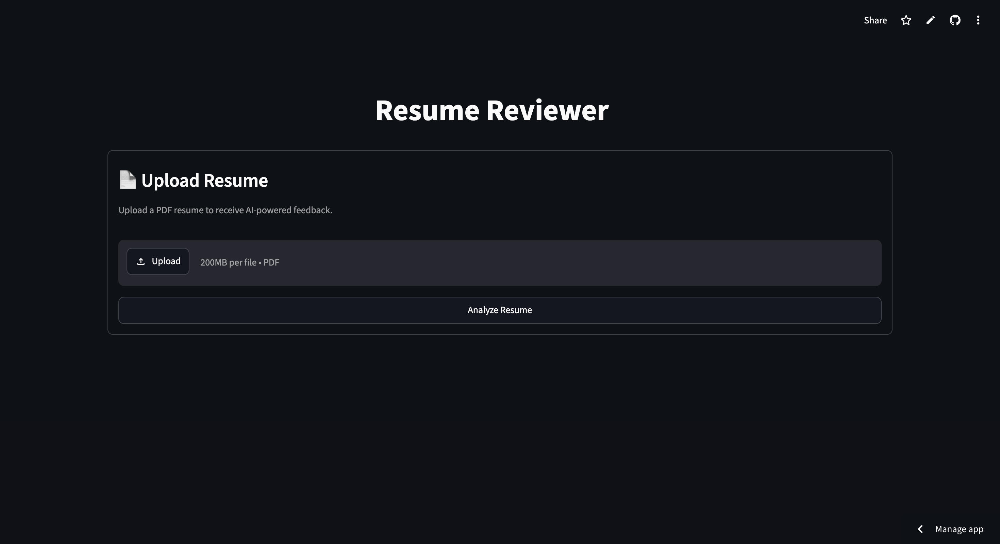
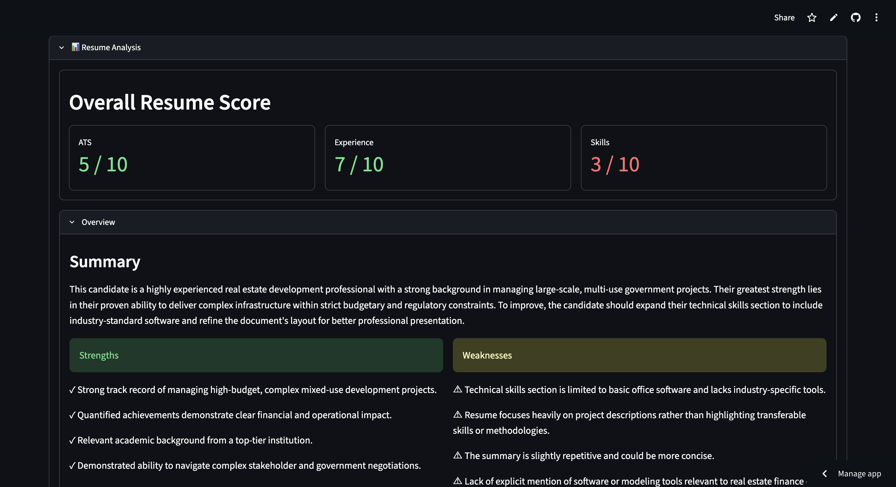
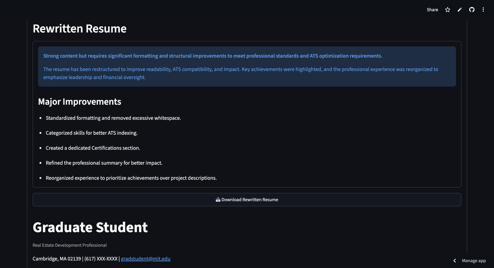
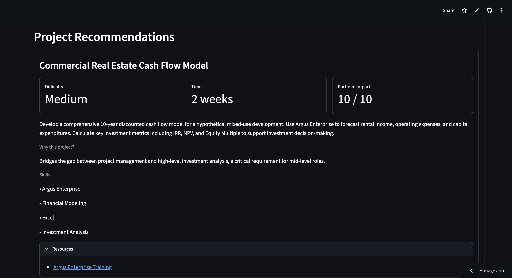

# AI Resume Analyzer

An AI-powered resume analysis application that uses **agentic workflows**, **Retrieval-Augmented Generation (RAG)**, **LLMs**, and **web search** to provide personalized resume feedback and portfolio recommendations.

The application analyzes a resume PDF, evaluates its strengths and weaknesses, identifies skill gaps, reviews ATS compatibility using a dedicated knowledge base, and recommends portfolio projects tailored to the candidate's background.

## Live Demo

🌐 **Streamlit App:** https://resume-reviewer-18.streamlit.app/

🎥 Demo Video: https://drive.google.com/drive/folders/1PEv2iaHpKeMmf3-gfLnoxBcoDRYGt8AR?usp=drive_link

## Screenshots

### Home



### Resume Analysis



### Resume Rewrite



### Project Recommendations



---

## Features

### Resume Parsing
- Extracts structured information from uploaded resumes
- Identifies:
  - Candidate profile
  - Education
  - Work experience
  - Skills
  - Projects
  - Certifications
  - Achievements
  - Professional links

### Resume Analysis
Provides recruiter-style feedback including:
- Executive summary
- Resume strengths
- Resume weaknesses
- Experience score
- Missing resume sections
- Formatting suggestions

### Skill Gap Analysis
Evaluates the candidate's technical profile and provides:
- Skill score
- Resume skill gaps
- Personalized learning recommendations
- Prioritized technologies to learn

### ATS Analysis (RAG)
Uses Retrieval-Augmented Generation with a curated ATS knowledge base to evaluate:
- ATS compatibility score
- Formatting issues
- Missing sections
- Keyword coverage
- Actionable ATS improvements

### Portfolio Project Recommendation
Uses a multi-step agent workflow to:
- Generate intelligent search queries
- Search the web for high-quality project ideas
- Filter duplicate and low-quality resources
- Recommend portfolio projects tailored to the candidate

### Resume Rewrite

Generates an improved, ATS-friendly version of the uploaded resume while preserving all factual information.

- Improves wording and readability
- Standardizes formatting
- Enhances ATS compatibility
- Provides a downloadable rewritten resume
- Explains every suggested change

---

## Architecture Overview

```
                Resume PDF
                     │
                     ▼
     Information Extraction Agent
                     │
                     ▼
       Resume Analysis Agent
          │          │
          │          ▼
          │    ATS RAG Agent
          │      │       │
          ▼      │       ▼
 Skill Gap Agent │ Resume Rewrite
          │      │
          └──────┴───────────┐
                              ▼
              Project Recommendation
                     Workflow
                        │
                Tavily Web Search
                        │
                        ▼
             Project Selection Agent
```

A more detailed explanation is available in **ARCHITECTURE.md**.

---

## Tech Stack

**Frontend**
- Streamlit

**Backend**
- Python

**LLM**
- Google Gemini 3.1 Flash Lite

**RAG**
- ChromaDB
- Gemini Embeddings

**Search**
- Tavily Search API

**Concurrency**
- ThreadPoolExecutor

**Environment**
- python-dotenv

---

## Installation

Clone the repository

```bash
git clone https://github.com/aparajaya18-star/Resume-Reviewer
cd Resume-Reviewer
```

Install dependencies

```bash
pip install -r requirements.txt
```

Create a `.env` file

```text
GEMINI_API_KEY=your_key
TAVILY_API_KEY=your_key
```

Run the application

```bash
streamlit run app.py
```

---

## Project Structure

```
resume-reviewer/
│
├── agents/
│   ├── information_extraction.py
│   ├── resume_analysis.py
│   ├── skill_gap.py
│   ├── ats.py
│   ├── project_recommendation.py
│   └── resume_rewrite.py
│
├── rag/
├── utils/
├── data/
├── app.py
├── orchestrator.py
├── ARCHITECTURE.md
├── requirements.txt
└── README.md
```

---

## Future Improvements

- Job matching
- Resume tailoring for job descriptions
- Interview preparation agent
- Cover letter generation
- Additional knowledge bases
- Support for DOCX resumes

---

## License

This project was developed as the final capstone project for the TDA Gen AI and Agentic AI Bootcamp.